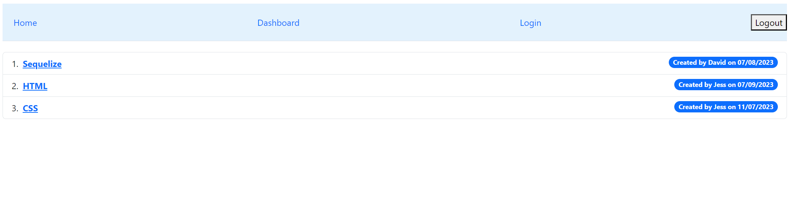
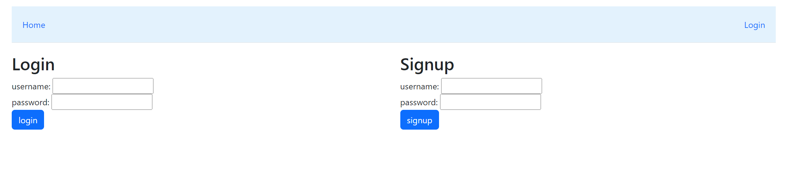
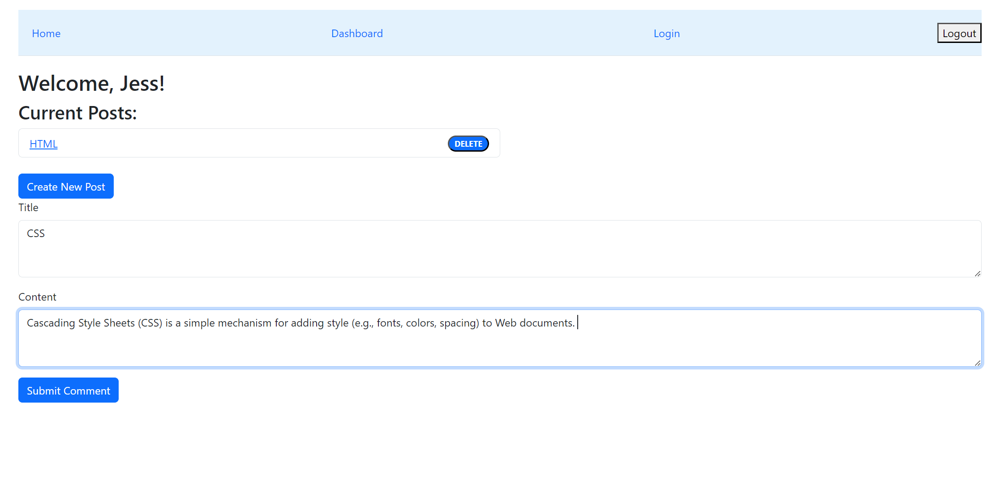
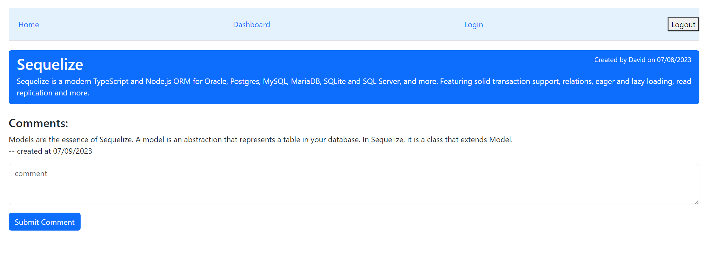
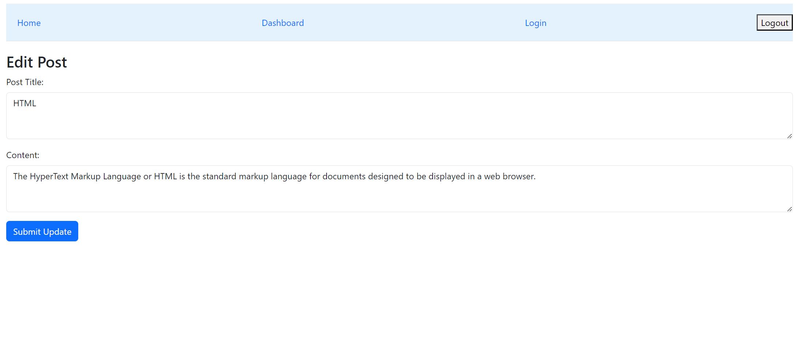

# CMS-style-blog-MVC

## Description

This CMS-style tech blog is a full stack application that allows users to view, create, update, delete blogs and comments. MVC paradigm in its architectural structure, using Handlebars.js as the templating language, Sequelize as the ORM, and the express-session npm package for authentication.
Please visit the application [here]().

## Table of Contents

- [Installation](#installation)
- [Usage](#usage)
- [Credit](#credit)
- [License](#license)
- [Reference](#reference)
- [Authors](#authors)

## Installation

To run the Project Inventory application locally, follow these steps:

1. Clone the repository to your local, [CMS-style-blog-MVC](https://github.com/gesu001/CMS-style-blog-MVC)
2. Install the dependencies: `npm install`
3. Set environment variables: Rename the `.env.EXAMPLE` file into `.env` and fill in the DB_USER and DB_PASSWORD with your database credentials and save the file.
4. Set up the database:

   - Navigate to db directory and open the mySql shell and execute the schema.sql by running `source schema.sql` to create database.
   - Navigate to root directory and run `npm run seed` to seed data to your database.

5. Start the server: `npm start`

## Usage

Once the application is up and running, follow these steps to use the blog:

1. Access the application through your web browser.
2. Create an account or log in if you already have one.
   
3. Add new post or comment
   
   
4. Edit the post
   
5. Log out when finished.

## Credit

N/A

## License

Please refer to the LICENSE in the repo.

## 💡 Reference

The Javascript code of this application refers to the following documentations:

- [Bootstrap](https://startbootstrap.com/previews/sb-admin-2)

- [mysql2](https://www.npmjs.com/package/mysql2)

- [Node.js](https://nodejs.org/en)

- [Github](https://github.com/)

- [JavaScript](https://developer.mozilla.org/en-US/docs/Web/JavaScript)

- [w3school](https://www.w3schools.com/js/default.asp)

- [Visual Studio Code](https://code.visualstudio.com/)

- [NPM](https://www.npmjs.com/package/inquirer)

- [Express.js](https://expressjs.com/en/5x/api.html)

- [Sequelize](https://sequelize.org/api/v6/identifiers)

- [MySQL 8.0 Reference Manual](https://dev.mysql.com/doc/refman/8.0/en/)

## Authors

- © 2023 [Ge Su](https://github.com/gesu001).
